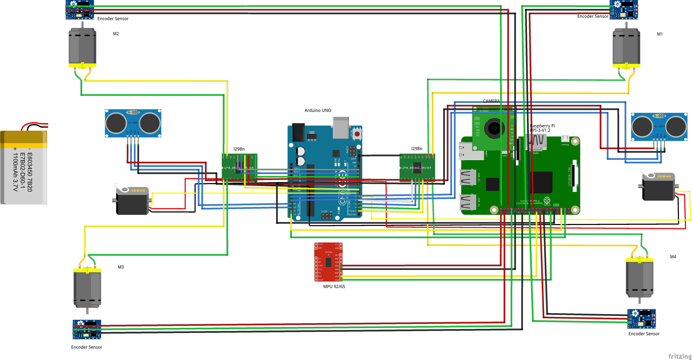
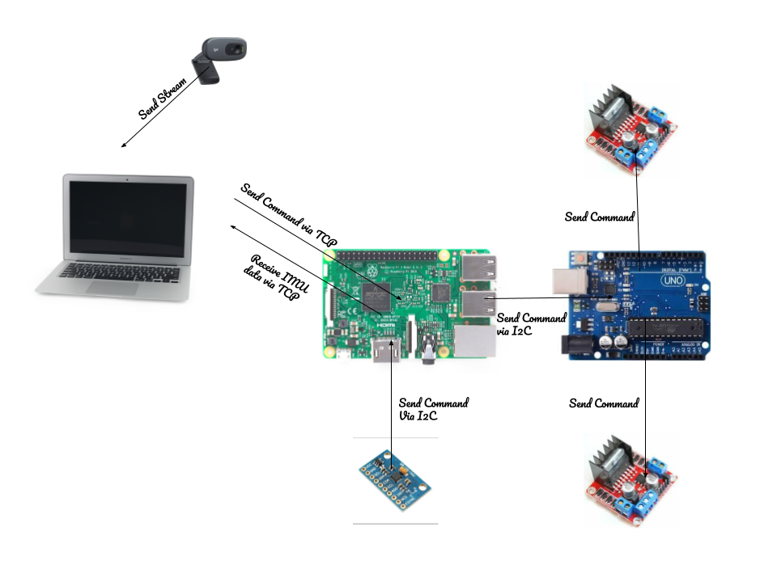
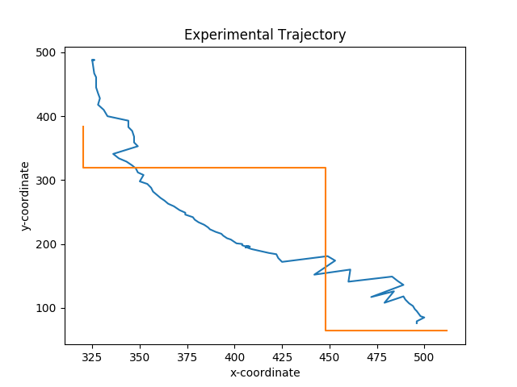
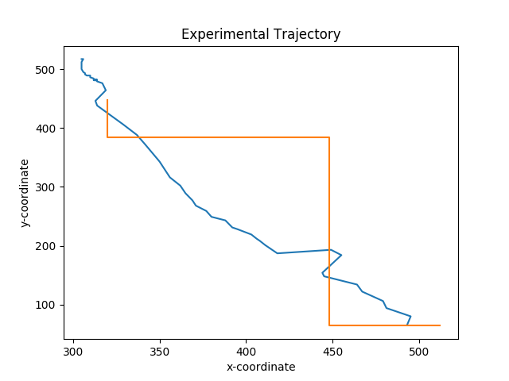

# Low-Cost Autonomous Vehicle for Inventory Movement in Warehouses

* [__Project Objectives__](#project-objectives)
* [__Our Model__](#our-model)
* [__Evaluation Parameters__](#evaluation-parameters)
* [__Evaluating Model__](#evaluating-model)
* [__About this repository__](#about-this-repository)
* [__Conclusion and Further work__](#conclusion-and-further-work)
* [__More Information__](#more-information)

## Project Objectives

Automation can help Warehouses become more efficient, productive, robust, and cost-effective. A variety of Autonomous Robots are used in large warehouses which can be expensive. We intend to build cost-effective Autonomous Robots for small and medium scale Warehouses with reasonable accuracy.

## Our Model

The robot is monitored by the camera, which sends the stream to the workstation. Using the procedure described below, the workstation sends a command(UP, DOWN, LEFT, RIGHT) to the rpi via a TCP connection. The rpi then sends this command to the Arduino. The Arduino then sends a message to motor drivers accordingly. IMUs and Wheel Encoders are attached to the robot, which sends data to the rpi via an I2C connection. The Arduino is also connected to two servo motors mounted at the front and back. Two ultrasonic sensors are also connected to the servos. This arrangement can be used for backup and collision avoidance.

The Source and Destination are provided by the user in the environment visible to the camera. A path is made from source to destination using the A-star Algorithm.
A colored marker is placed on the robot which is used to estimate the robot’s location and the heading. A line is drawn from the yellow to the purple marker which gives the Heading. The decision to move the next step is taken using the heading of the robot, the robot’s current location, and the next coordinate in the path to follow. 

  

## Evaluation Parameters

* **Cost and Accuracy:** There is a trade-off between the accuracy of the robot and the cost required to build it. 
* **Scalability:** Using an overhead camera for tracking, robots can easily be scaled up, to track and guide multiple robots.
* **Backup system:** Redundancy should be available that could be used in case of any failure with the primary system. 
* **Path Following and Reaching Destination:** To track the deviation while the robot is traversing the estimated path and check whether the robot can reach the destination or not. 

## Evaluating Model 

We Evaluate the results on the success rate of the robot in reaching the destination and the deviation in the path to reach the destination. We have considered that if the distance between the robot and destination is less than 20cm or 100px, then the robot is on the destination point. We draw the path that the robot should move on and the path that the robot moved on. We compare these paths to measure how close the robot was to the destination.
The computed path is shown in orange color and the actual path traversed by the robot is shown using the blue color. 

Out of 10 times, The robot was able to reach the destination 6 times. Hence, the accuracy of our model should be close to 60%. The robot is built with cheap hardware which is easily available making our robot very affordable. The robot also uses an overhead camera which facilitates greater scalability

## About this repository

* **rsc** contains images and other files used for aid in building the model and documenting the work.
* **src** contains the source code of the project consisting of three folders:
	* **Arduino** contains the code to be uploaded to Arduino. Arduino further contains three folders:
		* **Misc Codes** contains code that was used to learn about libraries. Most of these are taken from tutorials easily found online. It also contains code that is no longer used in the robot but was used for testing at some point. It contains code to get data from ultrasonic sensors, move servos, move motors, etc.
		* **libs** contain the libraries that were used in the Arduino Project.
		* **Important** contains the code that was at some point used in the project and still holds importance. It can be used to test various parts of the robot. For example- to move the robot, rotate ultrasonic sensors, etc.

	* **Workstation** contains two folders:
		* **Important** contains the final code that was used in the workstation. 
		* **Misc Codes** contains code that was used to learn about modules and to test the robot. Some of the code was previously used.

	* **rpi** contains two folders:
		* **Important** contains the final code that was used in the raspberry pi.
		* **Misc Codes** contains code that was used to learn about modules and to test the robot. Some of the code was previously used.

* Upload `Major-Project/src/Arduino/important/MotionWithRotatingHCSR04/MotionWithRotatingHCSR04.ino` to Arduino UNO.
* To run this code, upload `src/rpi/Important/master.py` to raspberry pi and run it. This would wait for a connection to the address specified in the code. 
* You would have to connect a camera to the workstation and place it so that the robot is clearly visible.
* Then run `Major-Project/src/Workstation/Important/Obstacle Detection` and `Path Planning/main2.py`, you may want to configure the `IP address` and `port` in `parameters.py` as well. 
* A window will appear showing the stream from the camera. Double-click on the window at the starting point of the robot and the destination. Press `Esc`. Now a path appears and the robot starts moving toward the destination. The robot should move as shown in 

## Conclusion and Further work

We have built a cheap and fairly accurate robot. It is versatile and can work in varied environments. Given the backup system and an overhead camera, the robot is fairly secure and scalable.​ The scope of the work can be enhanced in the future by employing novel ways of increasing accuracy with little changes in cost.​

## More Information

Please see my [Project Report](https://docs.google.com/document/d/1Ga6hZdya4-FO2D3pxWp_QicPi5e_mkiPZHorXCSN8MU/edit?usp=sharing) for more detailed information about this project. 

<!-- A paper was also published in ... titled ... You can Find it here ... You can also find the presentation for the paper here ... Please cite as ... -->

Please refer to [this playlist](https://www.youtube.com/playlist?list=PLMkePoybCpm4CkMRtGrQV7CXr9gtPblFH) to learn more about the robot