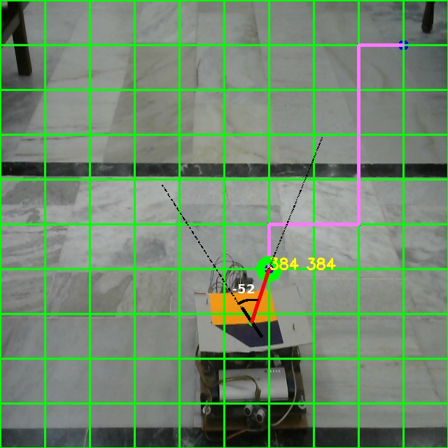

# Major-Project

## Project Objectives
Automation can help Warehouses become more efficient, productive, robust, and cost-effective. A variety of Autonomous Robots are used in large warehouses which can be expensive. We intend to build cost-effective Autonomous Robots for small and medium scale Warehouses with reasonable accuracy.

## Our Model

The robot is monitored by the camera, which sends the stream to the workstation. Using the procedure described below, the workstation sends a command(UP, DOWN, LEFT, RIGHT) to the rpi via a TCP connection. The rpi then sends this command to the Arduino. The Arduino then sends a message to motor drivers accordingly. IMUs and Wheel Encoders are attached to the robot, which sends data to the rpi via an I2C connection. The Arduino is also connected to two servo motors mounted at the front and back. Two ultrasonic sensors are also connected to the servos. This arrangement can be used for backup and collision avoidance.

The Source and Destination are provided by the user in the environment visible to the camera. A path is made from source to destination using the A-star Algorithm.
A colored marker is placed on the robot which is used to estimate the robot’s location and the heading. A line is drawn from the yellow to the purple marker which gives the Heading. The decision to move the next step is taken using the heading of the robot, the robot’s current location, and the next coordinate in the path to follow. 

## Evaluation Parameters
* **Cost and Accuracy:** There is a trade-off between the accuracy of the robot and the cost required to build it. 
* **Scalability:** Using an overhead camera for tracking, robots can easily be scaled up, to track and guide multiple robots.
* **Backup system:** Redundancy should be available that could be used in case of any failure with the primary system. 
* **Path Following and Reaching Destination:** To track the deviation while the robot is traversing the estimated path and check whether the robot can reach the destination or not. 

## Evaluating Model 
We Evaluate the results on the success rate of the robot in reaching the destination and the deviation in the path to reach the destination. We have considered that if the distance between the robot and destination is less than 20cm or 100px, then the robot is on the destination point. We draw the path that the robot should move on and the path that the robot moved on. We compare these paths to measure how close the robot was to the destination.
The computed path is shown in orange color and the actual path traversed by the robot is shown using the blue color. 

Out of 10 times, The robot was able to reach the destination 6 times. Hence, the accuracy of our model should be close to 60%. The robot is built with cheap hardware which is easily available making our robot very affordable. The robot also uses an overhead camera which facilitates greater scalability

## Conclusion and Further work

We have built a cheap and fairly accurate robot. It is versatile and can work in varied environments. Given the backup system and an overhead camera, the robot is fairly secure and scalable.​ The scope of the work can be enhanced in the future by employing novel ways of increasing accuracy with little changes in cost.​

